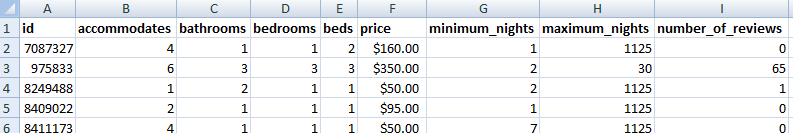

# K_Nearest_Neighbours_Airbnb_dc_listings
Uses the data release by Inside Airbnb (http://insideairbnb.com/get-the-data.html) for the DC area to test out the accuracy of the K Nearest Neighbors algorithm using Euclidean distance. This kernel uses 80-20 cross-validation.

The data (selected columns only) looks like this :

'price' is the dependant variable while the rest of the columns (except 'id') are the features we use to train our model.

The columns 'bathrooms','bedrooms' and 'beds' have a small number of missing values (about 1% of the rows) we hence delete these observations.

We normalize all columns to the standard normal deviation, as columns such as 'maximum_nights' and 'number_of_reviews' span much larger values and can have an skewed effect on the KNN model.

We then run the KNN algorithm using K=5 using 80-20 cross-validation. 

The Root Mean Square error obtained is about 111 usd, which is clearly quite high given that the dependant variable (price) values are mostly in the range of a few hundred dollars.

Next steps would be to:
1) Explore other features available in the original dataset.
2) Hyperparameter optimization to determine the best value of K.
3) Understand the impact of using k-folds cross-validation rather than 80-20 cross-validation
4) Try other Machine Learning algorithms and assess impact on rmse.

